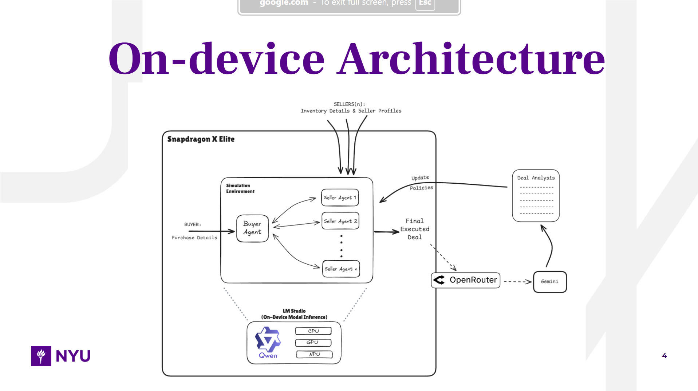
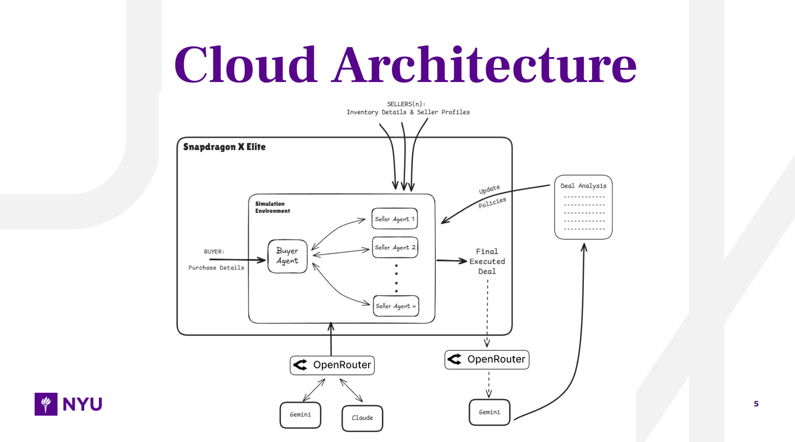

# Arbitrage

#### A multi-agent marketplace that models real-world buyer–seller negotiations to get the best possible outcome for both sides.

🏆 **Winner of Qualcomm Edge AI Track and Visa Challenge Track at HackNYU**

---

## Overview

Arbitrage is a secure, closed environment where buyer and seller agents negotiate on your behalf. The system simulates realistic market behavior by creating multiple seller agents, each with unique inventory, personality traits, and pricing policies. Through multi-round negotiations, the system executes deals on your behalf while documenting trade-offs discovered during negotiation.

### The Problem

Getting the best deal in a competitive market is extremely hard. Buyers can't realistically discover every seller or negotiate endlessly with all of them. Similarly, sellers can only tap into a fraction of the market and cannot pitch to every qualified buyer.

### Our Solution

Arbitrage creates a simulated marketplace where:

- **One buyer agent** negotiates with **up to 10 seller agents** simultaneously
- Each seller has unique inventory, pricing strategies, and personality traits
- Negotiations are **opaque**—buyers don't know seller costs or internal strategies
- All decisions are **LLM-driven** with no handcrafted scoring functions
- Complete audit trail of all negotiations and decisions

---

## Architecture

Arbitrage supports two deployment architectures to serve both B2B and B2C needs:

### On-Device Architecture

**For B2B teams prioritizing privacy and offline capability:**



- **Hardware:** Qualcomm Snapdragon X Elite
- **Inference:** LM Studio with Qwen3-1.7B model
- **Acceleration:** NPU/GPU/CPU hybrid acceleration
- **All agents run locally** with no cloud dependency

### Cloud Architecture

**For B2C use cases with flexible cloud requirements:**



- **Orchestration:** OpenRouter for hybrid reasoning
- **Models:** Gemini and Claude via OpenRouter
- **Deal Analysis:** OpenRouter + Gemini for post-negotiation analysis
- **Feedback Loop:** Policy updates based on deal analysis

---

## Technology Stack

### Backend

- **Framework:** FastAPI 0.104+
- **Orchestration:** LangGraph + LangChain
- **Database:** SQLite 3 with SQLAlchemy ORM
- **LLM Providers:**

  - **On-Device:** LM Studio (Qwen3-1.7B)
  - **Cloud:** OpenRouter (Gemini, Claude)
- **Streaming:** Server-Sent Events (SSE)
- **Validation:** Pydantic v2

### Frontend

- **Framework:** Next.js 14+ (App Router)
- **Styling:** Tailwind CSS
- **State Management:** Zustand
- **Real-time:** EventSource API (SSE)

---

## Key Features

### Core Capabilities

- ✅ **Multi-Agent Negotiations:** One buyer vs. multiple sellers (up to 10)
- ✅ **Opaque Opponent Models:** Buyers only see what sellers choose to reveal - AND - vice versa.
- ✅ **LLM-Driven Reasoning:** No handcrafted scoring—pure LLM decision-making
- ✅ **Real-time Streaming:** Live negotiation updates via SSE
- ✅ **Session Persistence:** Database-backed state for multiple negotiation runs
- ✅ **Per-Item Constraints:** Independent min/max pricing per item (no global budget)

### Agent Behaviors

- **Buyer Agent:**

  - Per-item price constraints (min/max)
  - @mention-based seller targeting
  - LLM-driven decision making
  - No knowledge of seller internals
- **Seller Agents:**

  - Unique inventory and pricing policies
  - Configurable personalities (rude ↔ very sweet)
  - Priority strategies (profit maximization ↔ customer retention)
  - Internal cost/least-price constraints (hidden from buyer)

### Negotiation Flow

```
Buyer Message → Message Routing (@mentions) → Seller Responses (parallel)
    ↓
Decision Check → [Accept/Reject/Continue] → Final Deal
    ↓
Deal Analysis → Policy Updates (feedback loop)
```

### Message Visibility

- **Buyer sees:** All seller messages, own constraints, seller names only
- **Sellers see:** Buyer messages mentioning them, own inventory/pricing
- **Hidden from buyer:** Seller costs, least prices, internal strategies

---

## Quick Start

### Prerequisites

- Python 3.11+
- Node.js 18+
- LM Studio (for on-device inference) or OpenRouter API key (for cloud)

### Backend Setup

```bash
cd backend

# Install dependencies
pip install -r requirements.txt  # or use pyproject.toml

# Configure environment
cp env.template .env
# Edit .env with your LLM provider settings

# Initialize database
python -m app.core.database

# Start server
uvicorn app.main:app --reload --host 0.0.0.0 --port 8000
```

### Frontend Setup

```bash
cd frontend

# Install dependencies
npm install

# Start development server
npm run dev
```

---

## Documentation

- [`docs/1_full_product_idea.md`](docs/1_full_product_idea.md) - Product overview and design principles
- [`docs/2_plan_layout.md`](docs/2_plan_layout.md) - Project planning and layout
- [`docs/3_backend_spec.md`](docs/3_backend_spec.md) - Backend implementation specification
- [`docs/4_frontend_spec.md`](docs/4_frontend_spec.md) - Frontend design specification
- [`docs/5_API_DOCUMENTATION.md`](docs/5_API_DOCUMENTATION.md) - Complete API reference

---

## Acknowledgments

- **Qualcomm** for Edge AI Track sponsorship
- **Visa** for Challenge Track sponsorship
- **HackNYU** organizers and judges
- **LM Studio** for on-device inference capabilities
- **OpenRouter** for cloud LLM orchestration

---

**Built with ❤️ at HackNYU 2025**
